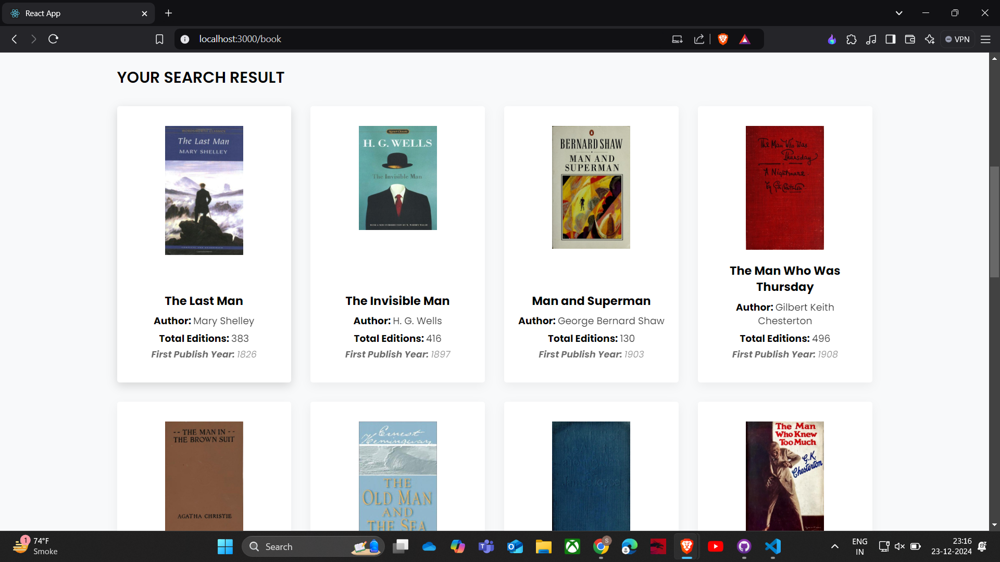
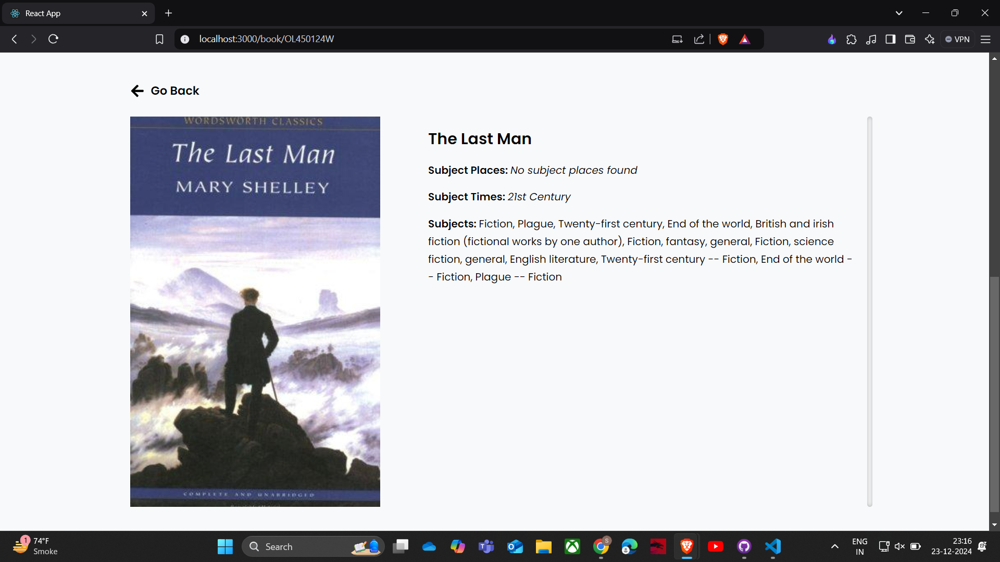

# **Book Search App**

## **Description**

The **Book Search App** is a React-based application that allows users to search for books using the Open Library Search API. Users can explore book details and navigate to a dedicated details page for each selected book. This project is built using **Create React App** and utilizes **Context API** for state management, providing a seamless and interactive experience.

---

## **Demo**

- **Live Demo**: [Project Link](https://book-store-sarvesh-yogis-projects.vercel.app/) _(if hosted online)_

---

## **Features**

- Search for books by title, author, or subject.
- View a list of search results with book details.
- Navigate to a detailed page for more information on a selected book.
- Clean and responsive design for an optimal user experience.

---

## **Installation and Usage**

### **Prerequisites**

- Node.js and npm installed on your system.

### **Setup Instructions**

1. Clone this repository:
   ```bash
   git clone https://github.com/SARVESHYOGI/Book-store.git
   ```
2. Install dependencies:
   ```bash
   npm install
   ```
3. Start the development server:
   ```bash
   npm start
   ```
4. Open your browser and navigate to `http://localhost:3000`.

---

## **Technologies Used**

- **React.js**: Frontend framework.
- **Context API**: For state management.
- **Open Library Search API**: For fetching book data.

---

## **How It Works**

1. The user searches for books using keywords like title, author, or subject.
2. The app fetches book data from the Open Library Search API and displays the results.
3. Clicking on a book navigates the user to a details page showing more information about the book.

---

## **Screenshots**

Example:  




---

## **Contributing**

Contributions are welcome! Please fork this repository and submit a pull request with your changes.

---
